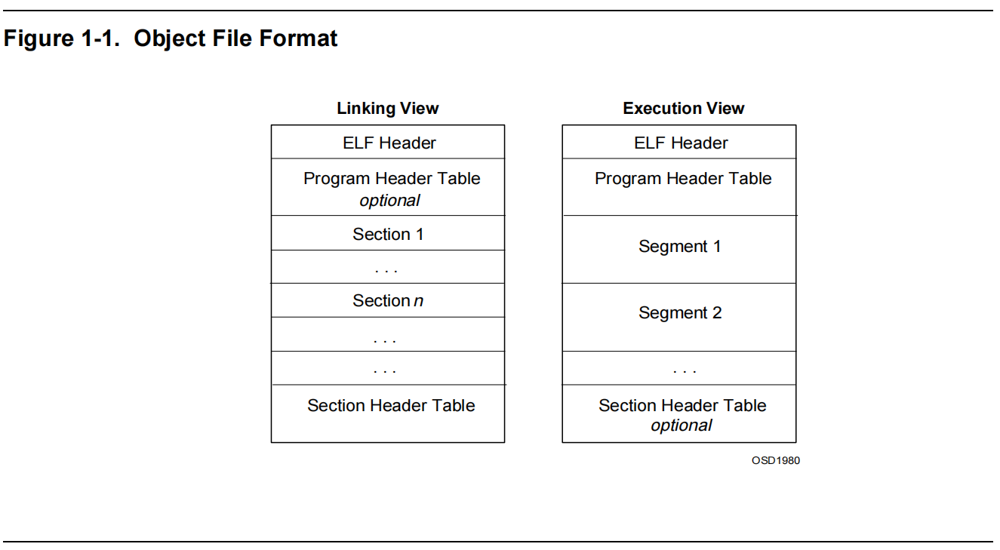

## ELF加载器

ELF加载器用于执行elf程序，由exec来调用

### ELF结构



ELF文件由ELF文件头，section table，若干个section,和program header组成，section table用于描述section而program header用于描述segment，section和segment区别是：segment位于内存中，通常包含了一个或多个section

ELF文件头：

```c
typedef struct elf64_hdr 
{
    unsigned char	e_ident[EI_NIDENT];	/* ELF "magic number" */
    Elf64_Half e_type;
    Elf64_Half e_machine;
    Elf64_Word e_version;
    Elf64_Addr e_entry;		/* Entry point virtual address */
    Elf64_Off e_phoff;		/* Program header table file offset */
    Elf64_Off e_shoff;		/* Section header table file offset */
    Elf64_Word e_flags;
    Elf64_Half e_ehsize;
    Elf64_Half e_phentsize;
    Elf64_Half e_phnum;
    Elf64_Half e_shentsize;
    Elf64_Half e_shnum;
    Elf64_Half e_shstrndx;
} Elf64_Ehdr;
```

其中e_entry表示入口点，e_phoff是program header的偏移，e_shoff是section header的偏移，e_shstrndx是字符串表索引，e_ehsize是elf头大小，e_phentsize是每个program header大小,e_phnum和e_shnum分别表示program head中entry的个数和section个数

section header结构:

```c
/*section head*/
typedef struct elf64_shdr {
  Elf64_Word sh_name;		/* Section name, index in string tbl */
  Elf64_Word sh_type;		/* Type of section */
  Elf64_Xword sh_flags;		/* Miscellaneous section attributes */
  Elf64_Addr sh_addr;		/* Section virtual addr at execution */
  Elf64_Off sh_offset;		/* Section file offset */
  Elf64_Xword sh_size;		/* Size of section in bytes */
  Elf64_Word sh_link;		/* Index of another section */
  Elf64_Word sh_info;		/* Additional section information */
  Elf64_Xword sh_addralign;	/* Section alignment */
  Elf64_Xword sh_entsize;	/* Entry size if section holds table */
} Elf64_Shdr;

```

其中sh_name是节区名字符串在字符串表中的索引

program header结构：

```c
/*segment head*/
typedef struct elf64_phdr {
  Elf64_Word p_type;
  Elf64_Word p_flags;
  Elf64_Off p_offset;		/* Segment file offset */
  Elf64_Addr p_vaddr;		/* Segment virtual address */
  Elf64_Addr p_paddr;		/* Segment physical address */
  Elf64_Xword p_filesz;		/* Segment size in file */
  Elf64_Xword p_memsz;		/* Segment size in memory */
  Elf64_Xword p_align;		/* Segment alignment, file & memory */
} Elf64_Phdr;

```

p_type表示segment的类型,当p_type为PT_LOAD，我们需要将对应将其读入内存，当p_type为PT_DYNAMIC时，表示该段包含动态链接信息，目前我们的加载器只支持静态链接的程序

### ELF加载流程

```c
typedef struct _ELFseg
{
  unsigned long needpage;
  unsigned long entry;
  Elf64_Ehdr elf_header;   
  Elf64_Phdr elf_ph[9];

  //页对齐
  void * segment[9];
}ELFseg;

```

以上结构体用于保存elf数据，needpage存储该结构体所占用的页面数，entry是入口点，不同于elf文件头的e_entry成员，这里entry需要重新计算

流程如下：

exec函数用于执行elf程序，会把参数传递给execve系统调用，在execve中会先进行内存分配等初始化操作，然后调用load_elf函数,load_elf函数进行其他初始化操作并调用initElf函数解析elf头部，然后调用load_segment函数根据program header内容将需要加载的段加载到内存，并重新计算入口点，由于我们os还未实现mmap，因此加载器通过文件系统提供的lseek和read方法来将sd卡数据读入内存，最后exec函数调用jumpTo函数，分配栈空间并跳转到入口点执行

